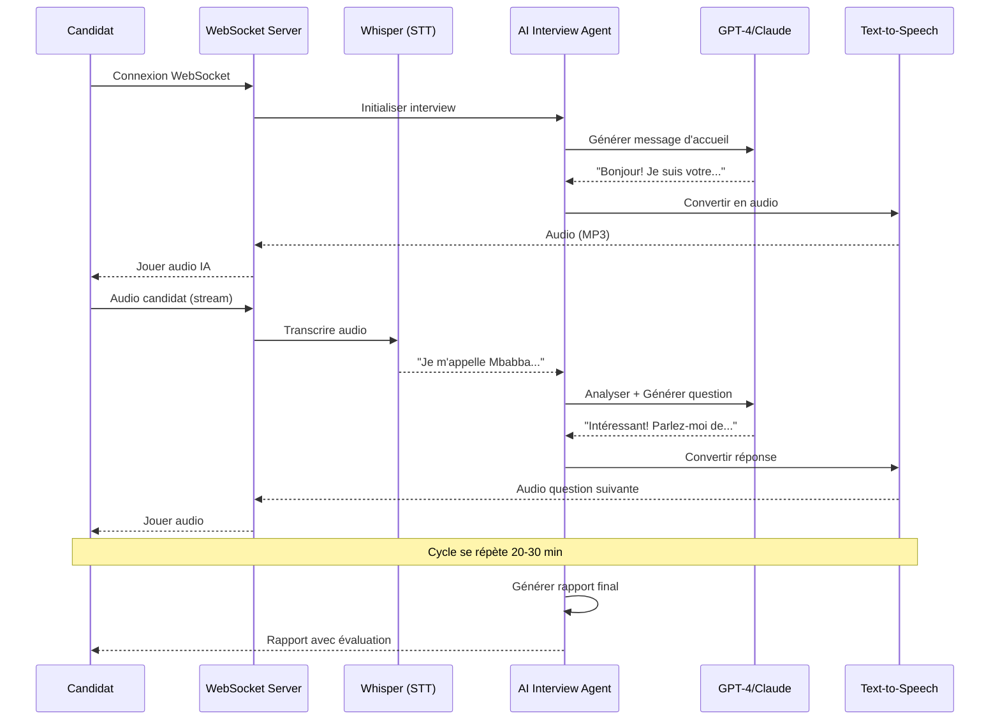

# 🏗️ Architecture Technique - RecruteTech AI Interviewer

## 🎯 Vision Système

**RecruteTech AI Interviewer** est un système d'Intelligence Artificielle qui conduit des **entretiens techniques autonomes** par vidéoconférence en temps réel, sans intervention humaine.

## 🧠 Concepts Clés

### Différence vs. Systèmes Classiques

| Système Classique | RecruteTech AI Interviewer |
|-------------------|----------------------------|
| Questions pré-enregistrées | ✅ **Conversation dynamique** avec l'IA |
| Vidéos one-way | ✅ **Dialogue bidirectionnel** en temps réel |
| Pas d'adaptation | ✅ **Questions adaptatives** selon réponses |
| Évaluation manuelle | ✅ **Évaluation automatique** en temps réel |
| Intervention humaine requise | ✅ **100% autonome** |

## 🔄 Flow d'un Interview Complet



## 🏗️ Architecture des Composants

### 1. **Frontend (Candidat)** - À développer

```javascript
┌──────────────────────────────────────┐
│     React Application                │
│                                      │
│  ┌────────────────────────────────┐ │
│  │  WebRTC Video/Audio             │ │
│  │  - getUserMedia()               │ │
│  │  - MediaRecorder API            │ │
│  └────────────────────────────────┘ │
│                                      │
│  ┌────────────────────────────────┐ │
│  │  WebSocket Client               │ │
│  │  - Send audio chunks            │ │
│  │  - Receive AI responses         │ │
│  │  - Display transcript           │ │
│  └────────────────────────────────┘ │
│                                      │
│  ┌────────────────────────────────┐ │
│  │  UI Components                  │ │
│  │  - Video display                │ │
│  │  - Audio player                 │ │
│  │  - Transcript                   │ │
│  │  - Progress indicator           │ │
│  └────────────────────────────────┘ │
└──────────────────────────────────────┘
```

### 2. **Backend (FastAPI + WebSocket)** ✅ Créé

```python
┌────────────────────────────────────────────────┐
│         FastAPI Application                    │
│                                                │
│  ┌──────────────────────────────────────────┐ │
│  │     WebSocket Manager                    │ │
│  │  - Handle connections                    │ │
│  │  - Route messages                        │ │
│  │  - Manage sessions                       │ │
│  └──────────────────────────────────────────┘ │
│                                                │
│  ┌──────────────────────────────────────────┐ │
│  │     Interview Session                    │ │
│  │  - Audio buffering                       │ │
│  │  - STT → Agent → TTS pipeline           │ │
│  │  - State management                      │ │
│  └──────────────────────────────────────────┘ │
└────────────────────────────────────────────────┘
```

### 3. **AI Interview Agent** ✅ Créé

```python
┌──────────────────────────────────────────┐
│       InterviewAgent                     │
│                                          │
│  Components:                             │
│  ┌────────────────────────────────────┐ │
│  │  LLM (GPT-4 / Claude)              │ │
│  │  - Understand responses            │ │
│  │  - Generate follow-up questions    │ │
│  │  - Adapt difficulty level          │ │
│  └────────────────────────────────────┘ │
│                                          │
│  ┌────────────────────────────────────┐ │
│  │  Conversation Memory               │ │
│  │  - Store chat history              │ │
│  │  - Maintain context                │ │
│  └────────────────────────────────────┘ │
│                                          │
│  ┌────────────────────────────────────┐ │
│  │  State Machine                     │ │
│  │  - Introduction → Background →     │ │
│  │    Technical → Conclusion          │ │
│  └────────────────────────────────────┘ │
│                                          │
│  ┌────────────────────────────────────┐ │
│  │  Evaluation Engine                 │ │
│  │  - Score responses in real-time    │ │
│  │  - Generate final report           │ │
│  └────────────────────────────────────┘ │
└──────────────────────────────────────────┘
```

### 4. **Speech Services** ✅ Créé

```python
┌─────────────────────────────────────────┐
│    SpeechToTextService                  │
│    (Whisper API)                        │
│                                         │
│  - Transcribe audio → text             │
│  - Support streaming                   │
│  - Multi-language (fr, en, wo)         │
└─────────────────────────────────────────┘

┌─────────────────────────────────────────┐
│    TextToSpeechService                  │
│    (OpenAI TTS / ElevenLabs)            │
│                                         │
│  - Synthesize text → natural speech    │
│  - Multiple voices                      │
│  - Streaming mode for low latency      │
└─────────────────────────────────────────┘
```

## 🔄 Pipeline de Traitement Audio

### Flow Détaillé

```
1. CANDIDAT PARLE
   └→ Microphone capture audio
      └→ MediaRecorder encode (WebM/Opus)
         └→ WebSocket send chunks

2. BACKEND REÇOIT
   └→ Buffer audio chunks (3s)
      └→ Send to Whisper API
         └→ Receive transcription text

3. AI TRAITE
   └→ Text → InterviewAgent
      └→ Agent analyze + generate response
         └→ LLM (GPT-4/Claude) process
            └→ Return AI response text

4. AUDIO GÉNÉRÉ
   └→ Text → TTS Service
      └→ Synthesize speech (MP3)
         └→ Send audio to client

5. CANDIDAT ÉCOUTE
   └→ Receive audio via WebSocket
      └→ Play through AudioContext
         └→ Display transcript
```

### Latence Typique

| Étape | Temps | Optimisation |
|-------|-------|--------------|
| Audio buffering | 2-3s | Nécessaire pour qualité STT |
| Whisper API | 1-2s | ✅ Rapide |
| LLM Processing | 2-4s | Streaming pour réduire |
| TTS Synthesis | 1s | Streaming pour réduire |
| **Total** | **6-10s** | Acceptable pour conversation |

## 🗂️ Structure des Fichiers

```
recrutetech-ai-interviewer/
├── README.md                          # ✅ Vue d'ensemble complète
├── QUICKSTART.md                      # ✅ Guide démarrage rapide
├── ARCHITECTURE.md                    # ✅ Ce fichier
│
└── backend/                           # ✅ Backend complet
    ├── requirements.txt              # ✅ Dépendances
    ├── .env.example                  # ✅ Template config
    ├── test_agent.py                 # ✅ Test script
    │
    └── app/
        ├── main.py                   # ✅ FastAPI + WebSocket
        │
        ├── core/
        │   └── config.py             # ✅ Configuration
        │
        ├── agents/
        │   └── interview_agent.py    # ✅ AI Agent principal
        │
        ├── services/
        │   └── speech_service.py     # ✅ STT + TTS
        │
        └── api/
            └── websocket/
                └── interview_ws.py   # ✅ WebSocket handler
```

## 🎯 Capabilities de l'Agent IA

### 1. **Conversation Naturelle**

L'agent IA peut:
- ✅ Comprendre le contexte conversationnel
- ✅ Poser des questions de suivi pertinentes
- ✅ S'adapter au niveau du candidat
- ✅ Reformuler si pas compris
- ✅ Donner des hints si candidat bloque
- ✅ Montrer de l'empathie

### 2. **Adaptation Dynamique**

```python
if candidate_answer_is_basic:
    ask_simpler_question()
elif candidate_answer_is_advanced:
    ask_deeper_technical_question()
elif candidate_seems_confused:
    rephrase_question()
```

### 3. **Évaluation Multi-critères**

L'agent évalue en temps réel:
- **Clarté de communication** (1-10)
- **Profondeur technique** (1-10)
- **Expérience pratique** (1-10)
- **Problem-solving** (1-10)
- **Motivation** (1-10)

### 4. **Types d'Entretiens**

```python
interview_types = {
    "technical": "Questions techniques approfondies",
    "behavioral": "Situations, STAR method",
    "code_review": "Review code en direct",
    "live_coding": "Coding challenge en temps réel",
    "system_design": "Architecture de systèmes"
}
```

## 🚀 Features Avancées (Roadmap)

### Phase 1: MVP ✅
- [x] Agent IA conversationnel
- [x] STT (Whisper)
- [x] TTS (OpenAI/ElevenLabs)
- [x] WebSocket real-time
- [x] Évaluation basique

### Phase 2: Advanced (3 mois)
- [ ] **Code Review Agent**: Analyse code en live
- [ ] **Vision Analysis**: Analyse posture, confiance via webcam
- [ ] **Live Coding Environment**: IDE intégré
- [ ] **Multi-agent System**: Spécialistes par domaine
- [ ] **Voice cloning**: Voix personnalisée par entreprise

### Phase 3: Intelligence (6 mois)
- [ ] **Emotion Detection**: Analyse émotions via voix
- [ ] **Lie Detection**: Patterns de mensonge
- [ ] **Personality Analysis**: Big Five traits
- [ ] **Cultural Fit**: Évaluation culture d'entreprise
- [ ] **Prédiction Performance**: ML pour prédire succès

## 🔒 Sécurité & Privacy

### Données Sensibles

```python
# Données collectées
data_collected = {
    "audio_recording": "Encrypted at rest",
    "video_recording": "Optional, encrypted",
    "transcript": "Stored 90 days, then deleted",
    "evaluation": "Permanent",
    "personal_info": "Minimal, RGPD compliant"
}
```

### Best Practices

1. **Encryption**: E2E encryption pour vidéos
2. **Anonymization**: Données anonymisées pour ML training
3. **Consent**: Candidat doit accepter explicitement
4. **Retention**: Auto-delete après 90 jours
5. **Access Control**: Only authorized recruiters

## 💰 Cost Analysis

### Par Interview (30 min)

| Service | Coût |
|---------|------|
| Whisper API (30 min) | ~$0.18 |
| GPT-4 (~5K tokens) | ~$0.15 |
| TTS (~2K chars) | ~$0.03 |
| **Total** | **~$0.36** |

### Scalabilité

- **10 interviews/jour**: $3.60/jour = $108/mois
- **100 interviews/jour**: $36/jour = $1,080/mois
- **1000 interviews/jour**: $360/jour = $10,800/mois

Plus **infrastructure** (serveurs, stockage, bandwidth).

## 📊 Performance Metrics

### Système

- **Uptime target**: 99.9%
- **Max concurrent interviews**: 100+ (avec scaling)
- **Average latency**: 6-10s par réponse
- **WebSocket connections**: Stable > 1h

### AI Quality

- **Transcription accuracy**: >95%
- **Question relevance**: >90% (human evaluation)
- **Evaluation consistency**: >85%
- **Candidate satisfaction**: >4.5/5 target

## 🌍 Multi-langue

### Support Actuel
- 🇫🇷 **Français**: Natif
- 🇬🇧 **Anglais**: Natif
- 🇸🇳 **Wolof**: En développement

### Expansion Prévue
- 🇲🇦 **Arabe Marocain**
- 🇨🇮 **Nouchi** (Côte d'Ivoire)
- 🇨🇲 **Pidgin** (Cameroun)

## 🔧 Technologies Utilisées

### Backend
- **FastAPI**: Framework web moderne et rapide
- **LangChain**: Orchestration agents IA
- **OpenAI GPT-4**: LLM conversationnel
- **Whisper API**: Speech-to-Text
- **OpenAI TTS**: Text-to-Speech
- **WebSocket**: Communication temps réel

### AI/ML
- **LLMs**: GPT-4, Claude
- **Speech**: Whisper, OpenAI TTS, ElevenLabs
- **Future**: Vision API, Emotion Detection

### Infrastructure (Production)
- **Docker**: Containerisation
- **Kubernetes**: Orchestration
- **AWS/GCP**: Cloud hosting
- **Redis**: Cache & pub/sub
- **PostgreSQL**: Database
- **S3**: Stockage vidéos

## 🎓 Innovation Technique

### Pourquoi c'est Unique

1. **Premier agent IA conversationnel** pour recrutement en Afrique
2. **Adaptation en temps réel** - pas de questions fixes
3. **Évaluation holistique** - au-delà du technique
4. **Multi-modal** - audio, vidéo, code, comportement
5. **100% autonome** - zéro intervention humaine

### Propriété Intellectuelle

- Algorithmes d'adaptation conversationnelle
- Pipeline d'évaluation multi-critères
- Système de détection de compétences
- Architecture multi-agent spécialisée

---

## 📞 Support Technique

Pour questions sur l'architecture:
- Voir code source dans `/backend/app/`
- Tester avec `python backend/test_agent.py`
- Documentation API: `http://localhost:8000/docs`

---

**Version**: 0.1.0-alpha  
**Date**: Novembre 2025  
**Status**: MVP Fonctionnel ✅
